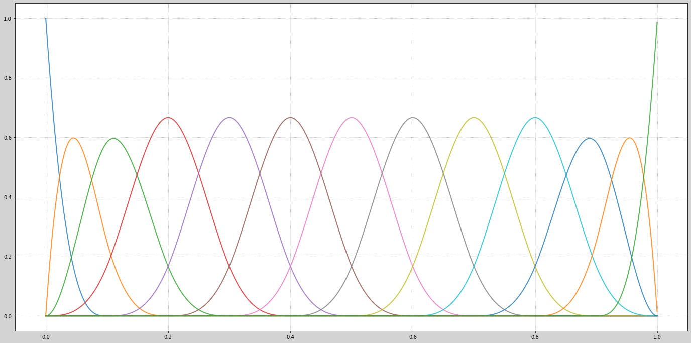

# Unbiased Risk Estimation in Projection Estimation

This project investigates the use of spline-based projection methods for **unbiased risk estimation** in nonparametric regression. It simulates data from a random regression function and evaluates the trade-off between bias and variance using different types of spline bases.

##  Features

- Simulation of noisy regression data
- B-spline and linear spline basis construction
- Projection estimation of regression function
- Risk decomposition: **bias² + variance**
- Empirical AIC risk estimation
- Modular structure with unified spline interface
- Beautiful plots of bias, variance, and risk

## Methodology

The regression function is approximated using projection onto spline bases. For each model complexity `m`, we estimate:

- The **mean squared bias**
- The **variance** of estimators
- The **total risk** = bias² + variance
- The **unbiased estimate of risk** via AIC formula

##  Spline Types Supported

| Type         | Description                       | Argument            |
|--------------|-----------------------------------|---------------------|
| B-spline     | Cubic spline (degree 3)           | `spline_type="bspline"` |
| Linear spline| Piecewise linear approximation    | `spline_type="linear"`  |

Switch between them using the `spline_type` parameter in `main.py`.

##  How to Run

```bash
# Install dependencies
pip install numpy matplotlib

# Run the main script
python main.py
```

You can change spline type by editing this line in `main.py`:

```python
spline_type = "linear"  # or "bspline"
```

##  Project Structure

```
unbiased_risk_estimation/
├── basis.py            # Spline basis functions
├── config.py           # Global configuration
├── estimation.py       # Risk, bias, AIC calculations
├── main.py             # Main script
├── plots.py            # Visualization utilities
├── simulation.py       # Data generation
├── utils.py            # Helpers (chi, delta, knots)
└── README.md           # Project documentation
```

##  Sample Output

- Bias-variance decomposition across model complexity
- Empirical distribution of AIC-selected model index
- Visualization of under- and over-smoothed fits

##  References

- P. L. Bartlett, M. Jordan, and J. McAuliffe (2006). *Convexity, classification, and risk bounds*.
- L. Wasserman (2006). *All of Nonparametric Statistics*.
- Model selection via unbiased risk estimation (AIC)
- Vladimir Spokoiny(2020). *Nonparametric estimation: parametric view*.

---

##  Sample Visualizations (B-spline)

### Oversmoothing vs. Undersmoothing


---

### B-spline Basis (m = 13)



---

### Bias and Variance Decomposition


---

### Risk vs. Unbiased Risk Estimation


---

### Oracle vs AIC Estimator


---

### AIC-selected Model Index (Distribution)


---

### Loss Distribution


